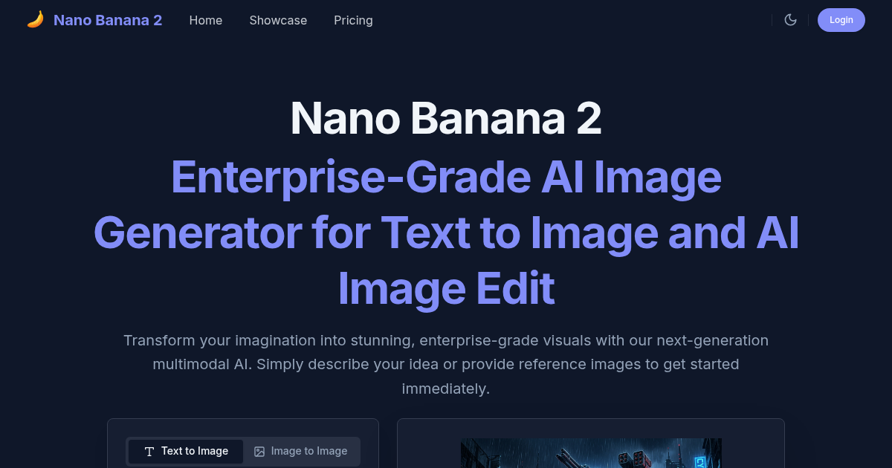

# Nano Banana 2

> AI Image Generator for stunning visuals and creative art

[](https://ainanobanana2.co)
[](LICENSE)



[**Nano Banana 2**](https://ainanobanana2.co) is a powerful AI image generation tool that transforms your creative ideas into stunning visual artwork. Whether you're a designer, content creator, or artist, Nano Banana 2 provides the tools you need to bring your imagination to life.

## ✨ Features

- **Text-to-Image Generation** - Create images from text descriptions with advanced AI
- **High-Resolution Output** - Generate crisp, detailed images for professional use
- **Multiple Art Styles** - Choose from various artistic styles and aesthetics
- **Fast Processing** - Get results in seconds with optimized AI models
- **Easy to Use** - Intuitive interface for creators of all skill levels

## 🚀 Quick Start

```python
# Example: Generate an image with Nano Banana 2 API
import requests

# Visit https://ainanobanana2.co to get started
response = requests.post("https://ainanobanana2.co/api/generate", json={
    "prompt": "A futuristic cityscape at sunset",
    "style": "digital art"
})
print(response.json())
```

## 📖 Use Cases

- **Marketing & Advertising** - Create eye-catching visuals for campaigns
- **Social Media Content** - Generate unique images for posts and stories
- **Game Development** - Design concept art and game assets
- **Digital Art** - Explore new creative possibilities

## 🔗 Links

- 🌐 **Official Website**: [Nano Banana 2](https://ainanobanana2.co)
- 📚 **Documentation**: Visit [ainanobanana2.co](https://ainanobanana2.co) for guides
- 💬 **Support**: Get help at [Nano Banana 2](https://ainanobanana2.co)

## 📄 License

This project is licensed under the MIT License - see the [LICENSE](LICENSE) file for details.

---

**Built with ❤️ by the [Nano Banana 2](https://ainanobanana2.co) team**
